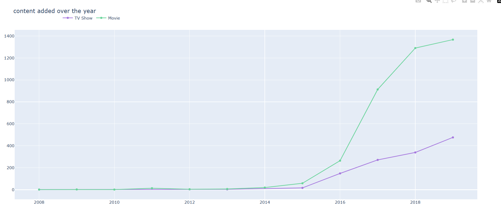
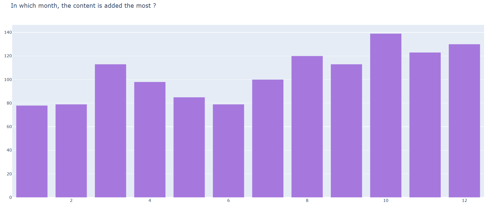
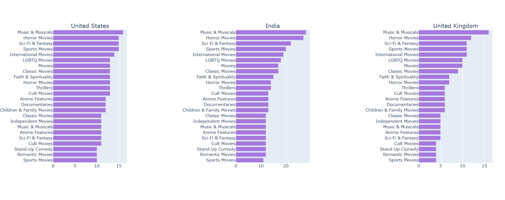
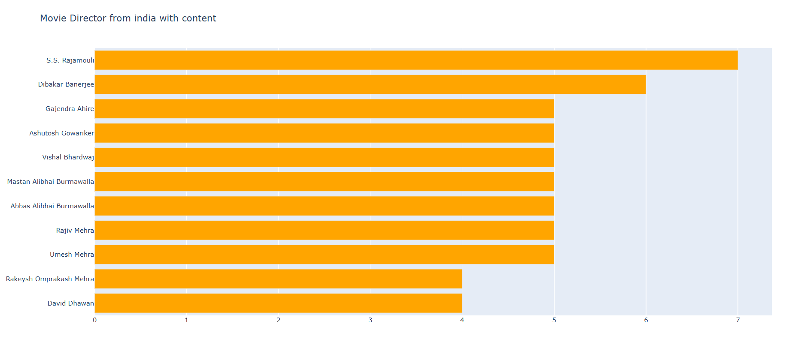

# Netflix Data Analysis
This project analyzes Netflix movies and TV shows using Python and Plotly. 
It visualizes trends by country, genre, release year, and more to provide insights into Netflix content.
## Dataset
- File used: `netflix_titles_nov_2019.csv`
- Columns: show_id, type, title, director, cast, country, date_added, release_year, rating, duration, listed_in, description
## 📊 Key Analyses Performed

### 1️⃣ Content Type Distribution (Movies vs TV Shows)
Analyzed how much of Netflix’s catalog is made up of Movies vs TV Shows.

### 2️⃣ Yearly Trends of Content Added
Observed how many titles were added each year to understand Netflix’s growth.

### 3️⃣ Release Year Analysis
Studied the distribution of release years to see which decades dominate.

### 4️⃣ Top Categories and Genres
Identified the most frequent genres on the platform.

### 5️⃣ Country-wise Content Distribution
Visualized which countries contribute the most Netflix content.

### 6️⃣ Top Actors and Directors
Extracted the most featured personalities based on cast and director lists.

### 7️⃣ Stand-Up Comedy Analysis
Filtered and analyzed titles belonging to Stand-Up Comedy.
## Libraries Used
- pandas
- plotly
- collections.Counter
- scipy
## 📸 Screenshots

